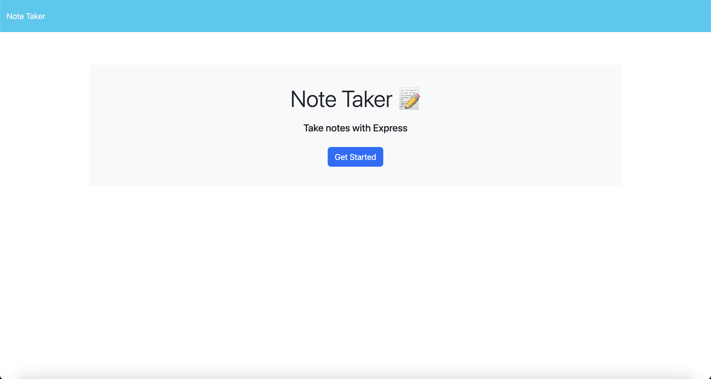
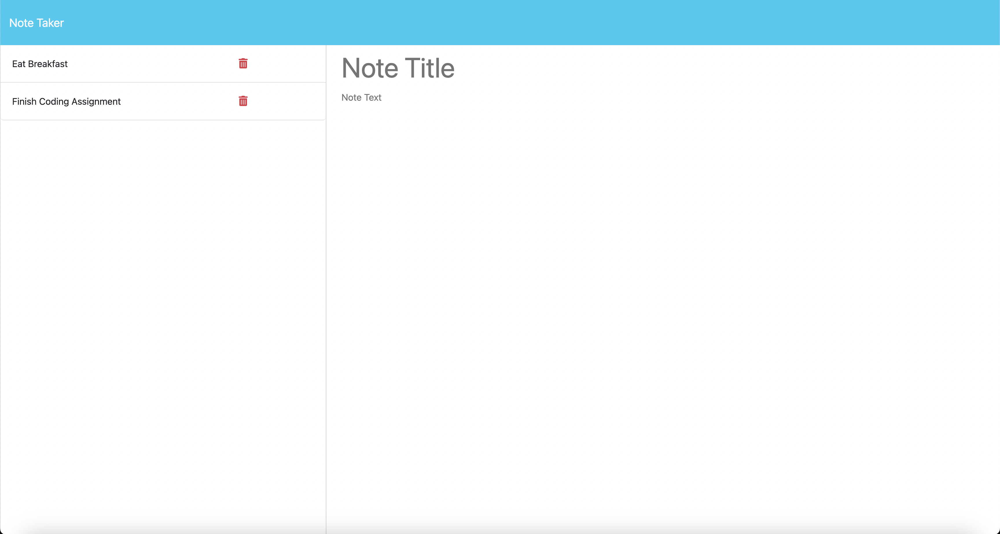
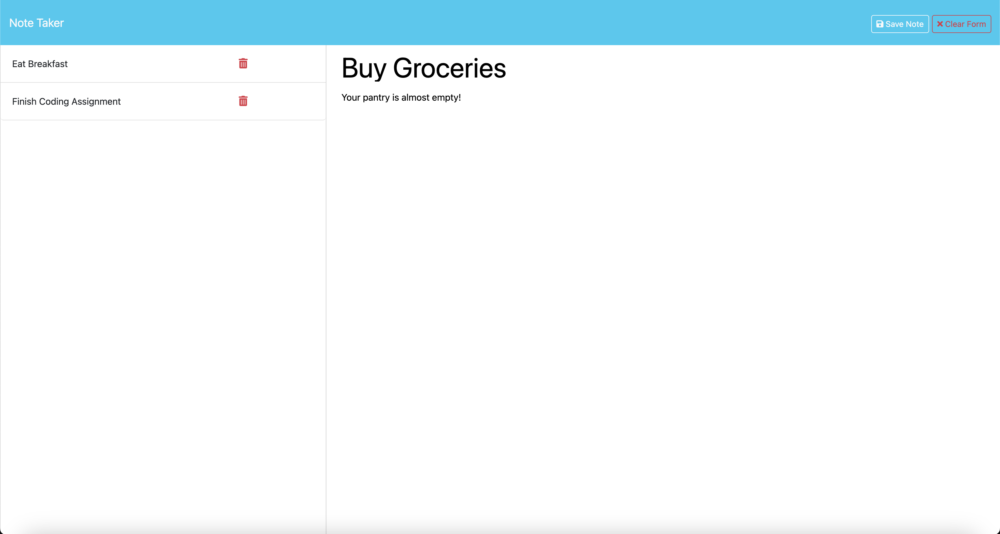

# Note Taker

## Description
Keep track of your daily tasks with this note taking application built with Express.js.

## Table of Contents
- [Description](#description)
- [Installation](#installation)
- [Usage](#usage)
- [Contribution](#contribution)
- [Tests](#tests)
- [License](#license)
- [Questions](#questions)

## Installation Instructions
To install this application, clone this repository to your local machine and install all relevant packages by executing "npm install". Please note, Node.js must be installed on your local machine for this application to run. 

## Usage
To use this application, visit the Heroku [link](https://note-taker-matt-kelly-3d734cb4b9bf.herokuapp.com/). To use this application on your local machine execute "node server.js" or "npm start" to start the application via your terminal. 

Once the application is running, click the "Get Started" button.

</img>

Here you will find a list of premade notes. Click the delete button on each of the notes to start from scratch. 

</img>

Enter your own note title and body, and click the "Save Note" button to save your note. Voila! You have successfully entered your own note. Happy note taking!

</img>

## Contribution Guidelines
This project was developed by Matt Kelly.

## Tests
There are no tests associated with this project. 

## License

This project is not licensed. For more information regarding licences, please visit this link: https://opensource.org/license/

## Questions
Please feel free to contact me via my GitHub or email below for any questions associated with this application:  
GitHub: [mattkellyirl](https://github.com/mattkellyirl)  
Email: mattkellyvisual@gmail.com